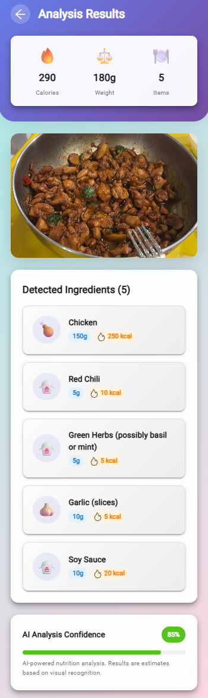
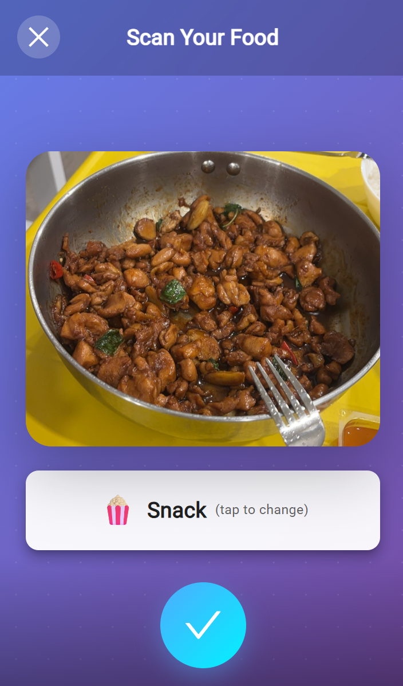
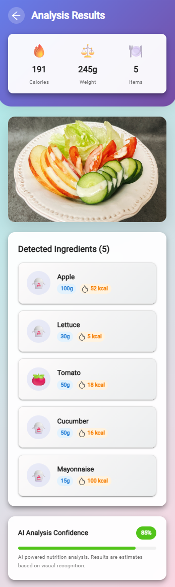

# 🍩 AI Food Log App

A full-stack web application built with **Spring Boot**, **React**, **MySQL**, **Spring AI (OpenAI)**, and **AWS S3**.

This project allows users to upload food images. The image is stored in AWS S3, analyzed by an AI to identify ingredients and estimate nutritional values, and then logged into a MySQL database.

## Tech Stack

-   **Backend**: Java 17, Spring Boot, Spring AI, AWS SDK
-   **Frontend**: React, Vite
-   **Database**: MySQL
-   **AI Service**: OpenAI (e.g., GPT-4o-mini)
-   **Cloud Storage**: AWS S3

## App Screenshots

<table>
  <tr>
    <td align="center"><b>User Home Page</b></td>
    <td align="center"><b>App Preview</b></td>
  </tr>
  <tr>
    <td></td>
    <td></td>
  </tr>
  <tr>
    <td align="center"><b>Select Food Type</b></td>
    <td align="center"><b>Scan Your Food</b></td>
  </tr>
  <tr>
    <td></td>
    <td></td>
  </tr>
  <tr>
    <td align="center"><b>Analysis Results</b></td>
    <td align="center"><b>User Profile</b></td>
  </tr>
  <tr>
    <td></td>
    <td></td>
  </tr>
</table>

## Prerequisites

-   Java 17
-   Maven
-   Node.js & npm
-   MySQL Server
-   AWS Account & S3 Bucket
-   OpenAI API Key

---

## How to Run

1.  **Clone the repository**:
    ```bash
    git clone https://github.com/MiziClare/food-nutrition-log-app.git
    cd food-nutrition-log-app
    ```

2.  **Setup Database**:
    -   Start your MySQL server.
    -   Execute the SQL script from the "Database" section below.

3.  **Configure Backend**:
    -   Open `src/main/resources/application.yml`.
    -   Update the `spring.datasource`, `spring.ai.openai`, and `aws` sections with your credentials as shown in the "Configuration" section.

4.  **Run Backend**:
    ```bash
    mvn spring-boot:run
    ```
    The backend runs on port `8080` by default.

5.  **Run Frontend**:
    ```bash
    cd portal
    npm install
    npm run dev
    ```
    The frontend runs on port `3000` or `5173` by default.

## Database

Execute the following SQL in your MySQL client to create the necessary database and tables.

```sql
CREATE DATABASE IF NOT EXISTS food_log_app DEFAULT CHARACTER SET utf8mb4 COLLATE utf8mb4_unicode_ci;
USE food_log_app;

-- User table
CREATE TABLE user (
  id INT AUTO_INCREMENT PRIMARY KEY,
  name VARCHAR(100) NOT NULL,
  email VARCHAR(255) NOT NULL UNIQUE,
  password VARCHAR(255) NOT NULL
);

-- Food log table: each uploaded image creates a record
CREATE TABLE food_log (
  id INT AUTO_INCREMENT PRIMARY KEY,
  user_id INT NOT NULL,
  image_path VARCHAR(255) NOT NULL,
  confidence INT NOT NULL,
  FOREIGN KEY (user_id) REFERENCES user(id)
);

-- Food ingredient table: each ingredient detected in an image creates a record
CREATE TABLE food_ingredient (
  id INT AUTO_INCREMENT PRIMARY KEY,
  log_id INT NOT NULL,
  ingredient_name VARCHAR(100) NOT NULL,
  kcal INT,
  weight DECIMAL(6,2),
  FOREIGN KEY (log_id) REFERENCES food_log(id)
);
```

## Configuration

Update `src/main/resources/application.yml` with your settings.

```yaml
spring:
  # ...
  ai:
    openai:
      # Use environment variables for sensitive data
      api-key: ${OPENAI_API_KEY}
      # ...
  datasource:
    url: jdbc:mysql://localhost:[PORT]/[TABLE_NAME]?useSSL=false&serverTimezone=UTC&characterEncoding=utf8&allowPublicKeyRetrieval=true
    username:
    password:

# ...

aws:
  # Public URL of your S3 bucket (e.g., https://<bucket-name>.s3.<region>.amazonaws.com)
  baseUrl: https://your-bucket-name.s3.your-region.amazonaws.com
  accessKey: YOUR_AWS_ACCESS_KEY
  secretKey: YOUR_AWS_SECRET_KEY

  s3:
    region: your-aws-region # e.g., us-east-2
    bucketName: your-s3-bucket-name
    # ...
````
